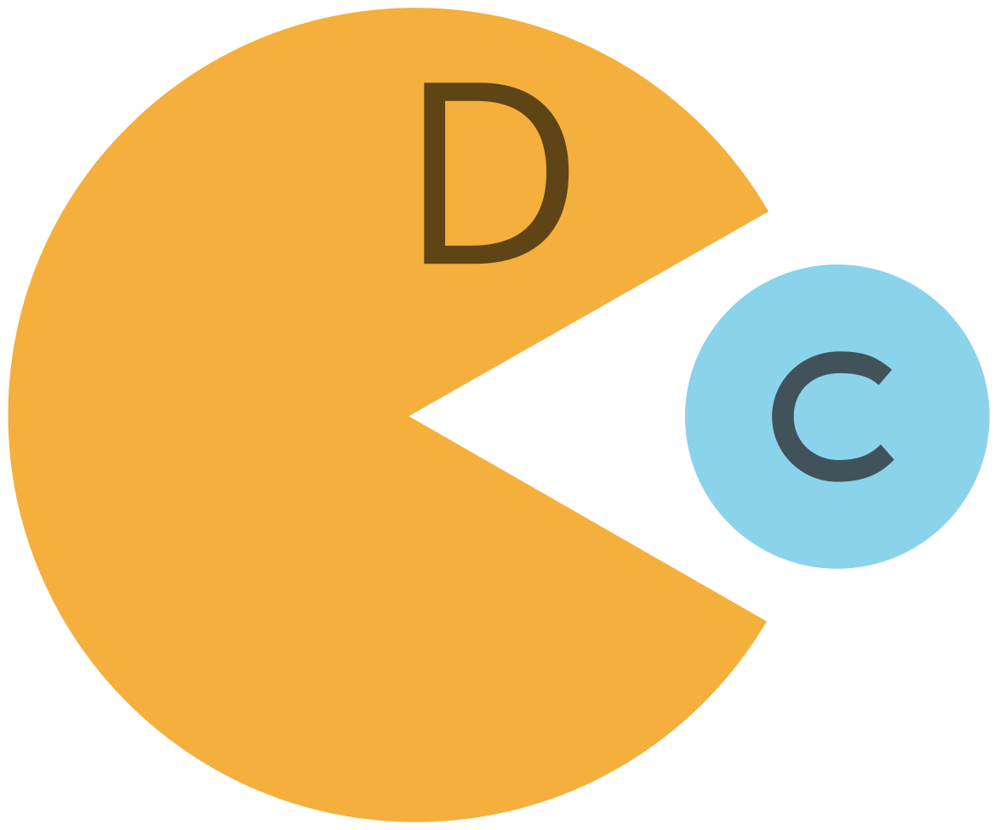
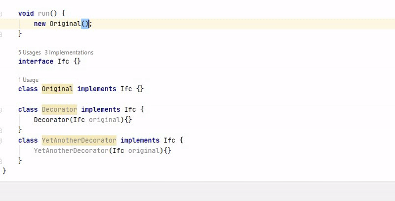

 

 

**Decorate.me** is an auto-completion Intellij IDEA 
20.1+ 
[plugin](https://plugins.jetbrains.com/plugin/14706-elegant-ide) 
suggesting you a list of all available [decorators](https://en.wikipedia.org/wiki/Decorator_pattern) for your Java object.

[Short demo](https://youtu.be/ZPHrfJN6f9Q)  
[Second one (Ru)](https://youtu.be/HDH0OlSIoZQ)

Features:

  * Suggests a list of all available decorators (by type)
  * Wraps the object in a decorator
  * Quick Documentation (Ctrl+Q)
  * Quick Definition (Ctrl-Shift-I)

Here is how it works:

## How to Use

Install using IDEA built-in plugin system:
  - <kbd>Plugins</kbd> > <kbd>Marketplace</kbd> > <kbd>Search for "Decorate.me"</kbd> > <kbd>Install</kbd>

Install manually:
  - Download the [latest release](https://plugins.jetbrains.com/plugin/14706-elegant-ide) and install it manually using <kbd>Plugins</kbd> > <kbd>Install plugin from disk...</kbd>

## Motivation

[Elegant Objects approach](https://www.elegantobjects.org/) proposes using composed decorators
instead of utility classes with a bunch of static methods.

Modern IDEs as IntelliJ IDEA have completions for methods.
Developers do not have to remember the names of methods, but can rather quickly find them using completions.
This gives the utility class based approach a great advantage.
But neither IDEA nor other IDEs won't complete you with decorators.
To use [EO approach](https://www.elegantobjects.org/) you will have to remember the names of all existing decorators for each type.

Here is `Decorate.me` Intellij IDEA plugin tha eliminates the tooling difference between using methods and decorators.
Just type a dot after an object, just like you would to call a method, then `Ctrl+Shift+Space`, 
and you will get all existing decorators bounded by a type that can be inferred from the context.
Choose one and press `Enter`.

With it, we can elegantly design classes and at the same time
use all the conveniences of modern tools.

[More detailed description of the problem](problem.md)

## How It Works
 
Axiom: If two classes implement same interface or abstract class, 
and the second one has at least one constructor,
which has this interface or abstract class as argument, 
then the second class is a decorator of the first,
and this constructor is a decorating constructor.

This plugin finds all such decorating constructors 
and provide them in completion list. 
When choosing such a completion, the original expression will be wrapped
with the selected constructor.

If you have the same interface

then `Decorator`'s constructor is a decorator for `ElegantObject` 
and for all classes that implement the `Decorable` interface.
So now if you type point after any object implementing the `Decorable` interface,
and call smart completion (Ctrl+Shift+Space)
`Decorator`'s constructor will be in completion list.

## How to Contribute

You can contribute by forking the repo and sending a pull request. You will need these tools
to be installed locally:

 1. JDK 17
 2. Gradle 8.2
 3. Lombok plugin
 4. Enabled annotation proccessing
  
Before sending a pull request, make sure all tests passed, and you covered your changes with new ones.

### Tips
 
- build the plugin

    `gradle build build`
 
- run embedded community edition idea with the plugin on board.
 
    `gradle intellij runIde`

- build and install the plugin to your own idea

    `gradle intellij buildPlugin`
  
    It generates a zip in `./build/distributions/`
    After that you have to install it manually in your IDE.

    <kbd>Plugins</kbd> > <kbd>Install plugin from disk...</kbd> > <kbd>Upload that zip</kbd>
  
