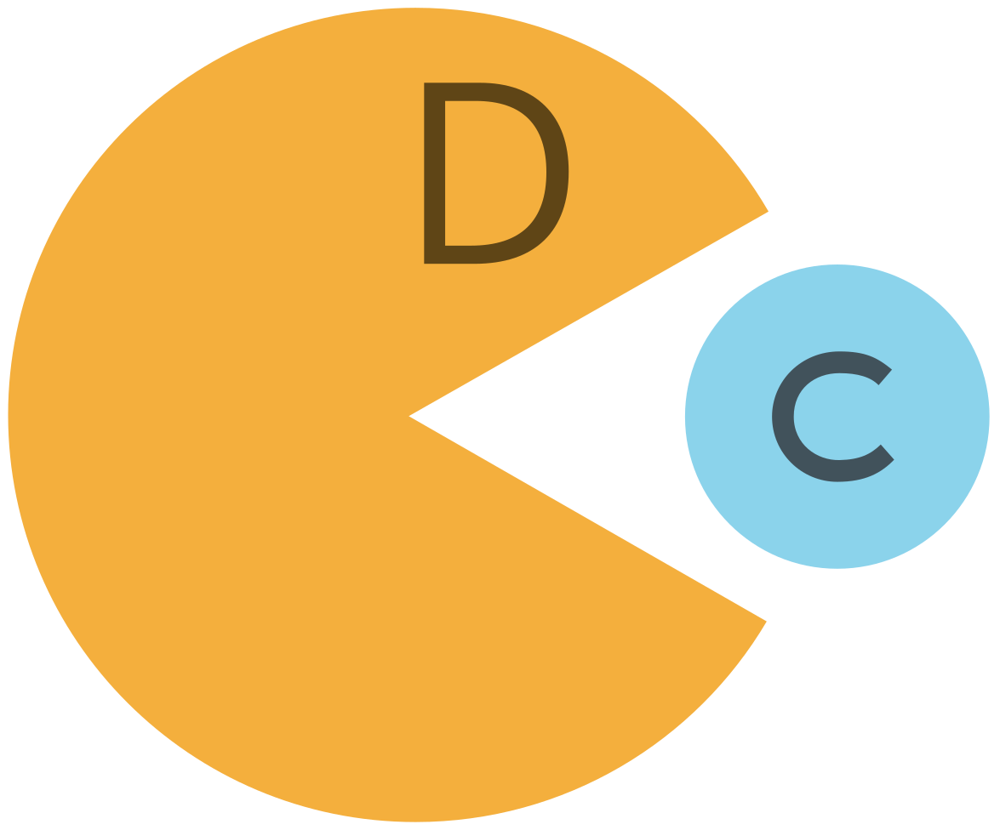
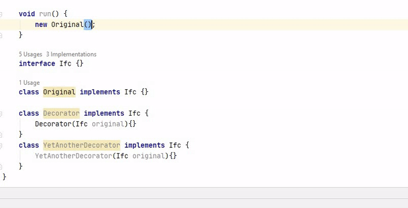

 

**Decorate.me** is an auto-completion Intellij IDEA 
20.1+ 
[plugin](https://plugins.jetbrains.com/plugin/14706-elegant-ide) 
suggesting you a list of all available [decorators](https://en.wikipedia.org/wiki/Decorator_pattern) for your Java object.

Features:

  * Suggests a list of all available decorators (by type)
  * Wraps the object in a decorator
  * Quick Documentation (Ctrl+Q)
  * Quick Definition (Ctrl-Shift-I)

Here is how it works:

